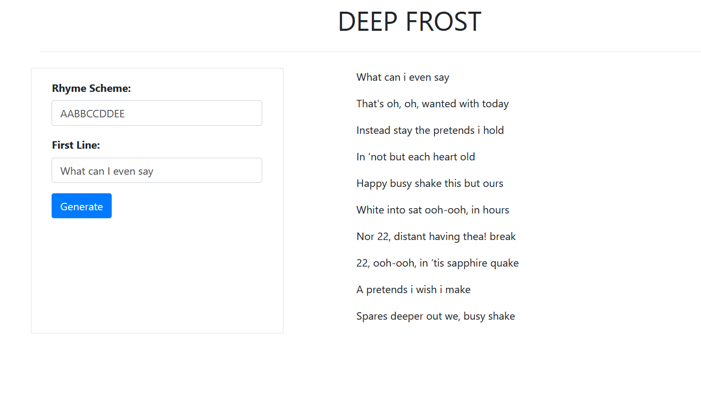

# DeepFrost
A poem generator based on text generation using a Gated Recurral Unit or GRU.

[DeepFrost can be tested out here!](https://deep-frost.herokuapp.com/)



## How does DeepFrost work?
DeepFrost generates poems that follow a rhyming scheme (provided by the user). The first sentence of the poem is to be entered by the user as a seed input along with the rhyming scheme. Each sentence of the "poem" is generated independently when seeded with the last word of the sentence.<br>

The last word of the sentence is chosen such that it is similar to the last word of the preceeding sentence and such that it follows the rhyming scheme. It uses Word2Vec word embeddings trained on the model's corpus to infer similar words. If no such word is found it chooses a word in the vocabulary that rhymes with the last word of the preceeding sentence. If no rhyming words are found in the vocabulary, the generator stops executing.

This implementation drew inspiration from the paper, [Shall I Compare Thee to a Machine-Written Sonnet? An Approach to Algorithmic Sonnet Generation](https://arxiv.org/abs/1811.05067).

## How to run Poem Generator
1. Clone the repo 
```bash
git clone https://github.com/HackerSpace-PESU/deep-frost
```
2. Install the dependences with 
```bash
pip install -r requirements.txt
```
3. To run the poem generator, use
```bash
cd src/
flask run
```
Note - The `app` directory contains the resources for the Heroku app and hence the scripts will throw errors if you try to run them on localhost. To run locally, use the Flask app resources present in the `src` directory.

## How to use custom training data?
The application has already been trained and uses the models in the `model` directory to generate. However, the application can also be trained to use custom lyrics or poems.

1. To train a new model, replace the directory paths in `w2v.py` and to your training corpora. As an example, a few documents have been included in the `data` directory.

2. Train a word2vec embedding model using the following command. This will produce an embedding model and save it in the `model` directory.
```bash
python3 w2v.py
```

3. To train the GRU model, first replace the directory path inside `train_gru.py` to point to your newly created word embedding model. Then run the following command to generate the generator model (also saved in the `model` directory).
```bash
python3 train_gru.py
```

4. Replace the paths inside `app.py` to point to the newly generated models. Run the application using 
```bash
flask run
```

## Pre-trained Models and Training Corpora
The pre-trained models can be found [here](https://drive.google.com/drive/folders/1yrmnKJ5h0KfIyt8ZxEiX0Y15kwzUMT9o?usp=sharing) as well as in the `model` directory. They were trained on a corpus of lyrics by Frost, Taylor Swift and John Keats, which can be found in the `data` directory.

